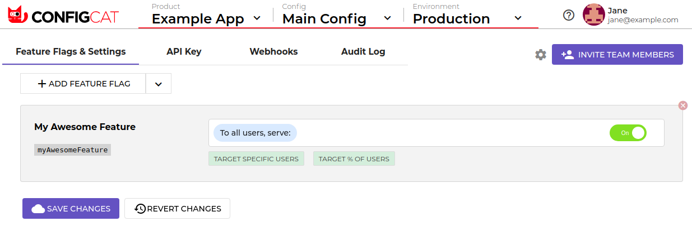

This page is an overview and a short guide to get started.

**ConfigCat** is a cloud based service that lets you release a feature to a part of your users without the need to actually deploy new code.

You can use it with many similar techniques such as feature flags/toggles, canary releases, soft launches, A-B testing, remote configuration management, phased rollouts.

# The birth of a Feature Flag

When creating working feature flag, first you will **add a switch** in the *ConfigCat Management Console*, then **connect your app** to the ConfigCat service.

## Create a feature flag on *ConfigCat Management Console*
1. <a href="https://app.configcat.com/login" target="_blank">Log in</a> to access the *Management Console*
2. **Create** a **product, environment** and  **config** if necessary. These will store your feature flag.
3. Click *ADD FEATURE FLAG* and give it a name.



## Connect your app
Find code examples on the <a href="https://app.configcat.com/connect" target="_blank">*Connect your applications*</a> tab on how to connect your application. Then you can access the value of your switch within your code.

This is an example code snippet to show the idea behind our SDKs:
```
npm i configcat-client
```
```js
var configcat = require("configcat-client");
var client = configcat.createClient("YOUR API KEY HERE");

client.getValue("isMyFeatureEnabled", false, (value) => {
    if (value === true) {
        do_the_new_thing();
    } else {
        do_the_old_thing();
    }
});
```