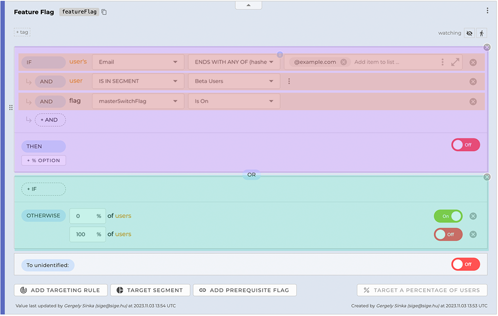

```
alapfogalmak, linkekkel a részletesebb leírásokra - User Object + a feature flag felépítése (l. Catnip terminology doksi: https://docs.google.com/document/d/1_ebnJRu16dd90RsMrr_C3HOWdTtXWZ-e0t2qyoBjggU)

hogy néz ki egy targetinges feature flag a dashboardon? + screenshot segítségével megmutatni, hogy a fogalmakhoz kapcsolódó dolgokat hol találja a dashboardon
egy pár mondat arról, hogy programozói oldalon mit kell csinálni, hogy működjön a targeting (ill. ha ez már le van írva máshol részletesebben, átlinkelni oda) + vsz. érdemes lenne egy dashboard screenshotos példát is adni hozzá: “ha van egy ilyen X ff-ed a dashboardon, akkor a programozóidnak ezeknek az Y user attribútumoknak a beadásáról kell gondoskodnia”
```

Using this feature you will be able to set different setting values for different users in your application. Let's say you would like to enable a feature only for the users within your company or only to a small percentage of your users before releasing it to the entire world.

## How does it work?

1. You define a [Targeting rule](TODO) on the <a href="https://app.configcat.com" target="_blank">ConfigCat Dashboard</a>.
2. You pass a [User Object](TODO) to the ConfigCat SDK in your application.
3. ConfigCat will use the User Object and the Targeting Rule to determine which features are enabled for the user.

## What is what?


### Feature Flag / Setting

A feature flag is a named boolean setting that can be turned ON or OFF. It is also known as a feature toggle, feature switch, feature flipper, conditional feature, etc.

The setting is a **string**, **integer**, **double** value that can be used to configure your application. It is also known as a configuration value, configuration setting, configuration parameter, etc.

### Targeting Rule

A targeting rule is a collection of conditions (IF / AND items) and values (THEN item). It is used to determine whether a feature flag or setting is enabled or not for a specific user. More about targeting rules [here](TODO).

### Condition (IF / AND item)

A condition is a boolean expression that can be evaluated to true or false. It is used to determine whether a targeting rule is a match or not for a specific user. More about conditions [here](TODO).

### Value

A value is the served value of a feature flag or setting. It can be a boolean, string, integer, or double value.

### Percentage option

A percentage option is a value that is served to a specific percentage of users. More about percentage options [here](TODO).

### "To all users" value / Fallback value

A fallback value is a value that is served to users who are not matched by any targeting rule. Or serves as a fallback value if a [User Object](TODO) is not given. More about fallback values [here](TODO).

## Examples
This is the simplest feature flag you can create. It is enabled for everyone.


This feature flag is enabled for everyone whose email address ends with `@example.com`.


This is a more complex feature flag. It is enabled for everyone whose email address ends with `@example.com` AND the OS is `iOS or Android`. This flag is also enabled for everyone who is among the `Beta Users` segment. Read more about segments [here](segments.md).


> 