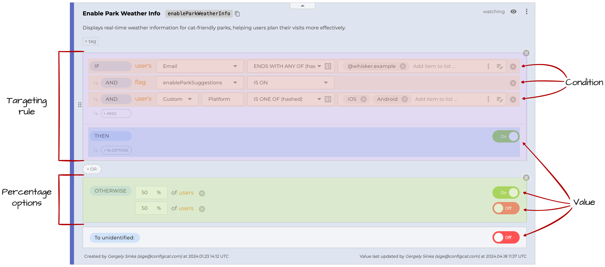
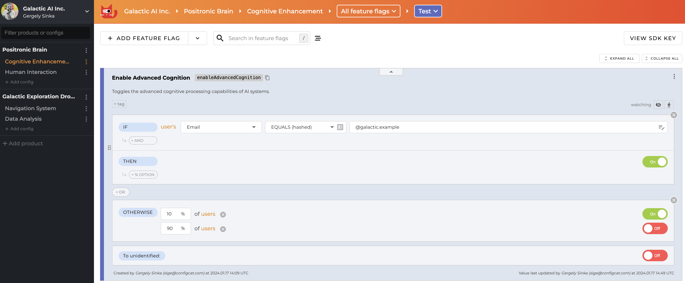

Using this feature you will be able to set different setting values for specific users or groups of users in your application. Typical use cases are:
- Beta testing
- A/B testing
- Phased rollouts, canary releases

## How does it work?

1. On the <a href="https://app.configcat.com" target="_blank">ConfigCat Dashboard</a>, you add [Targeting rules] and/or [Percentage options] to your feature flag.
2. In your application, you pass a [User Object] to the ConfigCat SDK.
3. The ConfigCat SDK will use the User Object and the rules defined on the Dashboard to determine whether feature should be enabled for the user.

## What is what?
*TODO - new screenshot*


### Feature Flag / Setting

A *setting* is a set of rules that yields a **boolean**, **string**, **integer** or **double** value, which can be used to configure your application. It is also known as a configuration value, configuration setting, configuration parameter, etc.

A *feature flag* is a setting that yields a **boolean** value, that is used to decide whether an application feature should be turned ON or OFF. It is also known as a feature toggle, feature switch, feature flipper, conditional feature, etc.

:::info
Throughout this documentation, we will use the term *feature flag* to refer to both feature flags and settings for simplicity, because feature flags are the most common type of settings.
:::

### Targeting Rule

A *targeting rule* consists of two parts: a collection of conditions and a value to serve. In case the conditions are met (the targeting rule *matches*), the value is served to the user. More about targeting rules [here].

### Condition

A *condition* is a logical expression that can be evaluated to true or false. There are three types of conditions: [User condition], [Flag condition (Prerequisite)], [Segment condition]. For a targeting rule to match, all of its conditions must evaluate to true. More about conditions [here].

### Percentage Options

Percentage options are used to split users into groups that will receive a specific value for a feature flag. The groups are based on the ratio of the percentages. Percentage options are often used for A/B testing or phased rollouts. More about percentage options [here].

### "To all users" / "To all other" / "To unidentified" value

A feature flag always contains a trivial "rule", a simple value, which comes after the actual rules. This value is returned when none of the preceding rules yields a result. Or they serve as a fallback value if a [User Object] is not given.

### User Object

A *user object* is a collection of *user attributes* that describe the properties of a user. Using these attributes in the conditions of the targeting rules, you can target specific users. More about the user object [here].

## Examples

### Phased rollout / Canary release / Percentage rollout Scenario

**Intent:** In our sample company (Galactic AI Inc.), we want to release a new feature (Advanced Cognition) to 10% of our users and everyone at our company. We want to make sure that the new feature is working as expected before we release it to everyone.

**Solution:** Have a feature flag called `Enable Advanced Cognition` with a percentage option of 10% and a targeting rule that matches everyone whose email address ends with `@galactic.example`.

#### Dashboard


#### Code

```js
// Create a user object
var user = {
    identifier: '867428724',
    email: 'isaac@galactic.example'
};

// Get the value of the feature flag
```


*TODO - come up with new examples and screenshots*

*TODO - Have a code example in parallel with the screenshots*

This is the simplest feature flag you can create. It is enabled for everyone.


This feature flag is enabled for everyone whose email address ends with `@example.com`.


This is a more complex feature flag. It is enabled for everyone whose email address ends with `@example.com` AND the OS is `iOS or Android`. This flag is also enabled for everyone who is among the `Beta Users` segment. Read more about segments [here](/targeting/targeting-rules/segment-condition).
