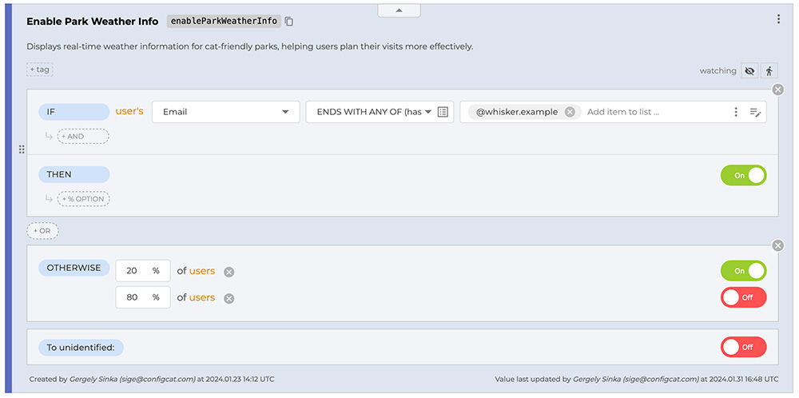

Targeting allows you to enable or disable a feature for specific users or groups of users in your application. Typical use cases are:
- Beta testing
- A/B testing
- Phased rollouts, canary releases

## How does it work?

1. On the <a href="https://app.configcat.com" target="_blank">ConfigCat Dashboard</a>, you add [Targeting Rules](../targeting-rule/targeting-rule-overview) and/or [Percentage Options] to your feature flag.
2. You pass a [User Object] to the ConfigCat SDK in your application.
3. The ConfigCat SDK will use the User Object and the rules defined on the Dashboard to determine whether the feature should be enabled for the user.

## What is what?


### Feature Flag / Setting

A *setting* is a set of rules that yields a **boolean**, **string**, **integer** or **double** value, which can be used to configure your application. It is also known as a configuration value, configuration setting, configuration parameter, etc.

A *feature flag* is a **boolean** setting to decide whether an application feature should be turned ON or OFF. It is also known as a feature toggle, feature switch, feature flipper, conditional feature, etc.

:::info
Throughout this documentation, we generally use the term *feature flag* to refer to both feature flags and settings for simplicity because feature flags are the most common type of settings.
:::

### Targeting Rule

A *targeting rule* consists of a collection of conditions and a value to serve. If the conditions are met (the targeting rule *matches*), the value is served to the user. More about targeting rules [here].

### Condition

A *condition* is a logical expression that can be evaluated to true or false. There are three types of conditions: [User condition], [Flag condition (Prerequisite)], [Segment condition]. For a targeting rule to match, all of its conditions must evaluate to true. More about conditions [here].

### Percentage Options

*Percentage options* are used to split users into groups that will receive a specific value for a feature flag. The groups are allocated based on the ratio of the percentages. Percentage options are often used for A/B testing or phased rollouts. More about Percentage Options [here].

### "To all users" / "To all other" / "To unidentified" value

A feature flag always contains a trivial "rule", a simple value after the actual rules. This value is returned when none of the preceding rules yields a result.

### User Object

A *user object* is a collection of *user attributes* that describe the properties of a user. Referencing these attributes in conditions allows you to define rules for targeting users. More about the user object [here].

### Default value

The ConfigCat SDK's feature flag evaluation functions (e.g. `GetValue`) requires you to provide a *default value*. This value will be returned in case the SDK fails to fetch the config or some other error occurs during the evaluation of the feature flag.

## Examples

### Phased rollout / Canary release / Percentage rollout Scenario

#### Goal

In our sample company (Whisker Co.), we want to release a new feature called `Park Weather Info`. Let's release the feature to everyone at Whisker Co. and to `20%` of our users. We want to ensure the new feature is working as expected before we release it to everyone.

#### Solution

Let's have a feature flag called `Enable Park Weather Info` with a targeting rule that matches everyone at Whisker Co. and a percentage option of `20%` `ON`.

Here is what the feature flag looks like on the Dashboard:


Here is how you to get the value of the feature flag in the code:
```js
import * as configcat from 'configcat-js';

// Create the user object
let userObject = new configcat.User(
  '867428724', // Identifier (required)
  'isaac@whisker.example', // Email (optional)
);

// Get the value of the feature flag
const value = await configCatClient.getValueAsync(
  'enableParkWeatherInfo', // Feature flag key
  false, // Default value
  userObject, // User object
);
```